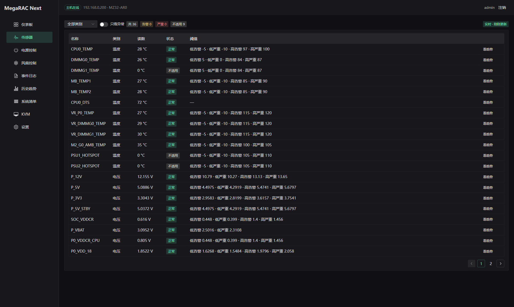
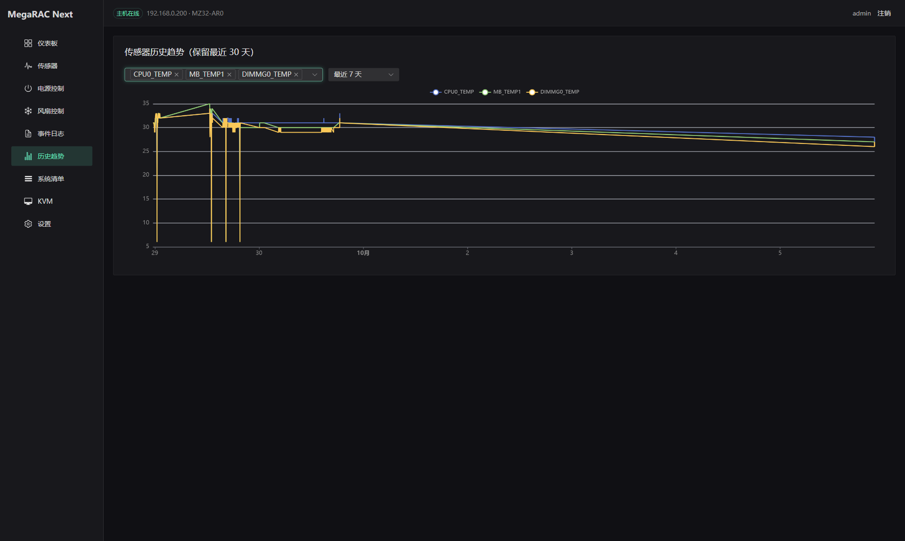
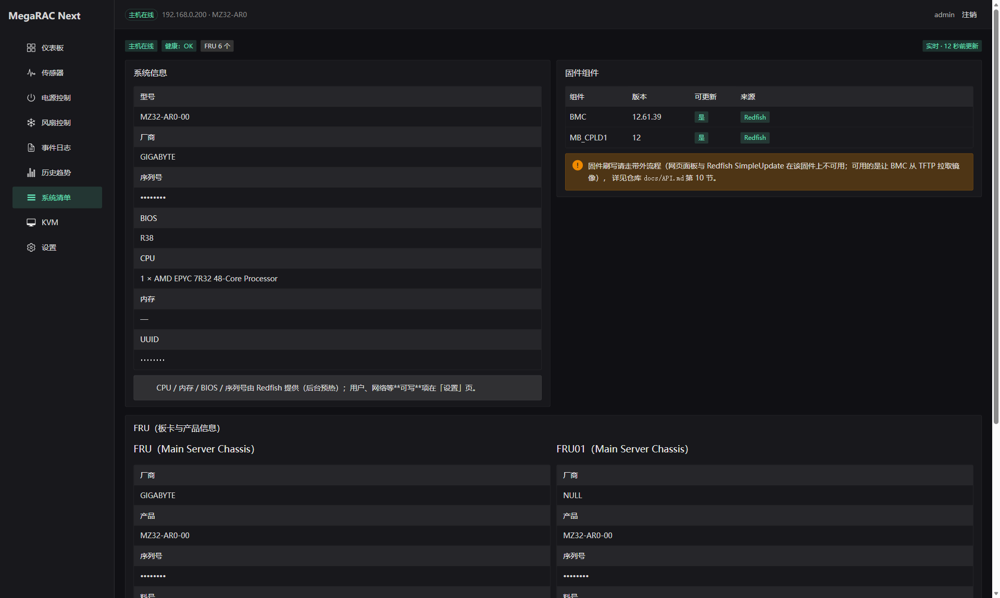
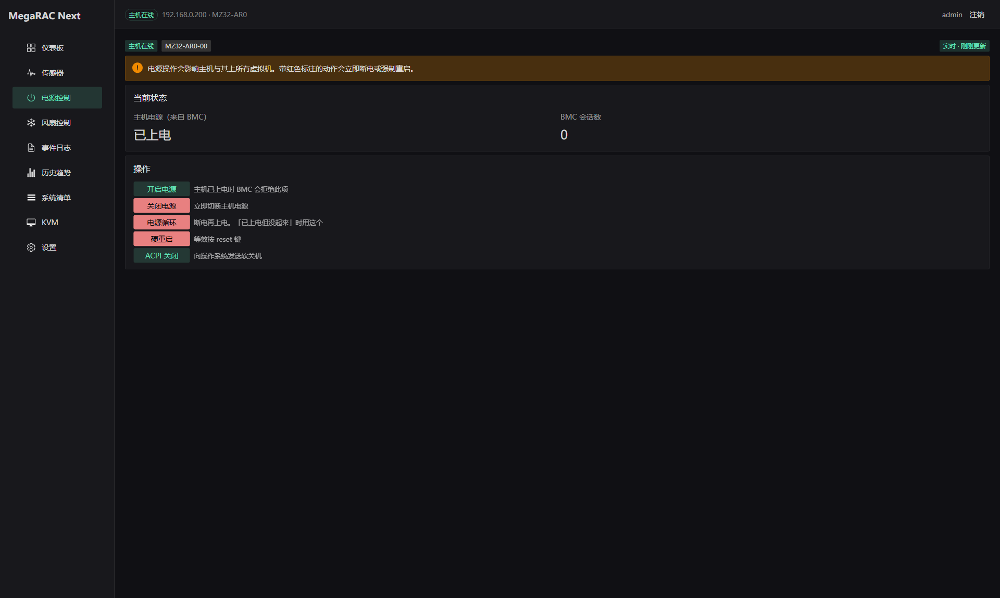

# MegaRAC-Next

把技嘉主板上的 **AMI MegaRAC SP-X** BMC（ASPEED **AST2500** 管理芯片）管理界面，
逆向后重制成了一个现代化的 Web UI —— 并附带一个**完全自研的 KVM 播放器**。

原厂界面是十多年前的风格（Bootstrap 3 + jQuery、满屏英文长表），这个重制版用
Fastify + Vue 3 + Naive UI + ECharts 重写：界面简体中文、暗色优先、移动端可用。

> 面向的 BMC 固件是 **12.61.39**。协议结论均来自实机验证，未验证的会明确标注；
> 端点清单、会话协议、风扇写协议、KVM / SOL / 虚拟介质协议见 [`docs/API.md`](docs/API.md)。

## 界面

| 仪表盘 | 传感器 |
|---|---|
|  |  |

| 风扇曲线编辑器 | 历史趋势 |
|---|---|
|  |  |

| 事件日志（SEL） | 系统清单 |
|---|---|
|  |  |

| KVM 远程控制台 | 电源控制 |
|---|---|
|  |  |

## 功能

| 页面 | 说明 |
|---|---|
| **仪表盘** | BMC 固件 / 主板与 BIOS / 传感器健康统计 / 会话与运行时长 / 最热几处 / 风扇转速 + 温度与风扇双实时趋势图 |
| **传感器** | 全量传感器表（读数、单位、健康状态、四档阈值），按类别过滤、只看异常、一键跳历史趋势；未安装的传感器（读数为 0）判为「不适用」而非误报严重 |
| **电源控制** | 开机 / 关机 / ACPI 软关机 / 硬重启 / 电源循环，均带二次确认 |
| **风扇控制** | 完整策略编辑器：Step / Slope 算法、源传感器与被控风扇多选、初始占空比、滞回、TDP / 环境温度 / PCIe 执行条件；曲线编辑器支持 6 种预设形状取样为有限数据点（等距或按斜率自适应取点）与增删数据点 |
| **事件日志** | SEL 全表 + 关键词 / 传感器 / 方向筛选 + 分页 |
| **历史趋势** | 代理侧定时采样落盘（`HistoryStore` 接口 + SQLite），多传感器叠加对比 |
| **KVM** | 自研播放器：实时画面、键鼠、截图、全屏、缩放、Ctrl+Alt+Del / Win / PrintScreen 等特殊键、页内电源控制、在线客户端列表 |
| **系统清单** | 只读：系统身份（型号 / 序列号 / BIOS / CPU / 内存 / UUID / 健康）、固件组件清单（BMC / BIOS / MB_CPLD 及「可更新」标记）、FRU 板卡与产品信息 |
| **设置** | 只放可写项：用户（增删改）/ 网络 / 日期时间 / 服务；含「清理僵尸会话」自救按钮 |

## 架构

```
浏览器（Vue 3 SPA）
   │  归一化接口 /api/overview · /api/sensors · /api/sel · /api/inventory + /bmc/* 透传 + /api/kvm
Fastify 代理（Node/TS，单进程，持有 BMC 会话）
   ├─ 经典 web API 客户端（逆向所得）
   ├─ Redfish 客户端 + 后台预热器
   └─ KVM 中继（wss → ws）
BMC（AMI MegaRAC SP-X，ASPEED AST2500 管理芯片）
```

**数据层**：以**经典 web API 为骨干**（固件、传感器、SEL、电源、风扇曲线、用户、网络——快且稳定），
**Redfish 作增补**（BIOS 版本、序列号 / UUID、CPU 与内存摘要、健康状态、固件组件清单——这些经典接口拿不到）。
增补数据由后台预热器旁路获取并缓存，**任何请求都不等 Redfish**，拿不到就如实标注降级，
界面用「数据来源徽标」显示数据新鲜度。

**页面分工**：每类数据只出现在一个页面——「系统清单」只放**看**的，「设置」只放**改**的。

**宽屏**：仪表盘与系统清单内容最大宽度 1720px 居中；仪表盘的两张趋势图、清单页的信息卡片按断点分栏。

代理侧对 BMC 的容错（单会话池化、串行队列、登录冷却、按资源熔断、请求去重）见 [`docs/API.md`](docs/API.md)。

## KVM 播放器

不复用原厂 `viewer.min.js`，只复用 BMC 自带的解码 worker（固件内 `/libs/kvm/ast/decode_worker.js`），整条链路自己实现：

```
BMC ──wss /kvm──► 代理（Node）──ws /api/kvm──► 浏览器
                    │  · IVTP 握手（含必须的 CONNECTION_COMPLETE 头）
                    │  · 服务端按帧重组（帧头 86B + CompressSize）
                    │  · 主从协商（CMD_SET_NEXT_MASTER）
                    └  · 键鼠 USB-HID 报文编码（与原厂逐字节一致）
```

关键设计是**服务端重组整帧**再下发给浏览器：BMC 的视频帧是差分的，浏览器直接解析裸流
容易在重连/刷新时出现黑块；由服务端保证每次下发的是完整帧，前端只做解码渲染。
协议细节与实现要点见 [`docs/API.md` 第 7 节](docs/API.md)。

## 快速开始

需要 Node ≥ 24（历史趋势用内置 `node:sqlite`）。

```bash
npm ci

npm run dev:server   # 代理，默认 http://0.0.0.0:5177
npm run dev:web      # 前端，默认 http://0.0.0.0:5173
```

浏览器打开 `http://localhost:5173`，用 **BMC 的账号密码**登录（凭证只经代理内存转发，不落盘）。

类型检查：`npm -w server run typecheck`、`npm -w web run typecheck`；构建：`npm run build`。

可用环境变量（都有默认值，一般无需改）：

| 变量 | 默认 | 说明 |
|---|---|---|
| `BMC_BASE` | `https://192.168.0.200` | BMC 地址 |
| `HOST` / `PORT` | `0.0.0.0` / `5177` | 代理监听 |
| `BMC_TIMEOUT_MS` | `30000` | 经典接口单请求超时 |
| `BMC_MAX_QUEUED` | `8` | 串行队列上限（防雪崩） |
| `BMC_LOGIN_COOLDOWN_MS` | `15000` | 两次登录最小间隔（防重登风暴） |
| `RF_MIN_INTERVAL_MS` | `250` | 两次 Redfish 请求的最小间隔 |
| `RF_BUCKET_MAX` | `25` | Redfish 限流：每 10 秒最多请求数 |
| `RF_AUGMENT_INTERVAL_MS` | `90000` | Redfish 增补的后台刷新间隔 |
| `HISTORY_DB` | `data/history.sqlite3` | 历史趋势库 |

## 生产部署

一个 Node 进程同时提供 SPA 与 API，只开一个端口：

```bash
npm ci && npm run build
BMC_BASE=https://192.168.0.200 npm start      # http://<这台机器>:5177/
```

常驻方式（systemd / Windows 服务 / Docker）、TLS 反代、安全须知与排错见
[`docs/DEPLOY.md`](docs/DEPLOY.md)。

## 目录结构

```
docs/API.md        逆向文档：端点清单、会话协议、风扇写协议、KVM / SOL / 虚拟介质协议、固件升级路径
docs/images/       README 配图
server/            Fastify 代理
  bmc.ts             经典 web API 客户端（单会话池化 + 登录冷却/熔断 + 串行队列）
  redfish.ts         Redfish 客户端（单会话 + 长超时 + 限速 + 按资源熔断 + 封禁退避）
  augment.ts         Redfish 增补的后台预热器
  models.ts          归一化模型层：经典 API 为骨干 + Redfish 增补，并标注来源/降级
  kvm.ts             KVM 中继：握手、整帧重组、主从协商
  kvm-route.ts       /api/kvm（WS 中继）与 /api/kvm/decoder.js（解码 worker 代理）
  hid.ts             键鼠 USB-HID 报文构造
  history/           采样器 + HistoryStore（SQLite 实现）
web/               Vue 3 + Vite 前端
  src/api/           统一客户端、模型类型、轮询组合式函数
  src/components/    数据来源徽标、实时趋势图
  src/pages/         各页面
  src/kvm/           KVM 客户端与键码表
deploy/            生产部署产物（systemd unit）
reverse/           逆向工作区（探针脚本 + 采集样本；AMI 版权产物已 gitignore）
```

## 已知限制

- **虚拟介质（挂 ISO）不可用**：SP-X 的 vMedia 属 **LMEDIA / RMEDIA 授权模块**（AMI 按包授权），
  BMC 侧开关写入返回 200 却不生效，需向 AMI 或技嘉取得 license key。协议本身已逆向完整
  （[`docs/API.md` 第 8 节](docs/API.md)）。
- **部分写操作受限**：用户增删改可用；服务配置写入会被 BMC 拒绝（需扩展权限）；
  日期时间与网络属于高危项，界面已标注其状态。
- **相对鼠标在带图形界面的客机上的表现未验证**：USB-HID 报文与原厂逐字节一致，
  并已确认送达主机；绝对定位模式可正常使用。
- **Redfish 增补字段可能延迟或缺失**：BMC 的 Redfish 响应慢且偶发不可用，
  所以 BIOS / UUID / 固件组件等增补信息由后台预热提供，界面会标注新鲜度与降级情况。
- **BMC 会话表仅 148 格**（频繁重启代理会留下孤儿会话把它占满，之后连登录都被拒）。
  代理已做单会话池化、登录冷却与熔断；卡死时**登录页有「重置 BMC」按钮**（用你填的账密经 Redfish 重置，
  无需登录），详见 [`docs/API.md` 第 7 节](docs/API.md)。
- **BMC 时钟**未启用 NTP 时会停在出厂时间，SEL 时间戳会不准。

## 免责声明

本项目用于管理**自己拥有**的服务器硬件，逆向对象是自己这台机器上的固件前端。
仓库内不含 AMI 的版权代码与二进制（`source.min.js` / `viewer.min.js` / `libs/kvm/*` 等已在
`.gitignore` 中排除），KVM 解码 worker 由代理在运行时从 BMC 自身取回。
