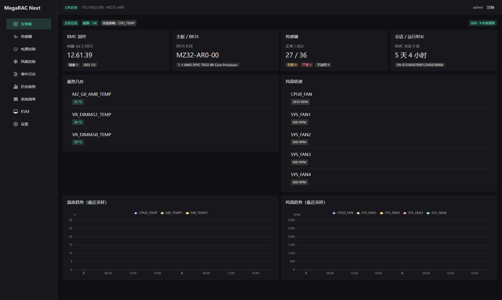
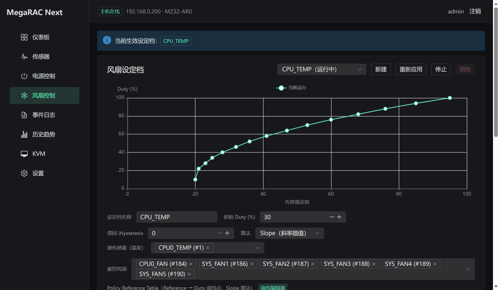
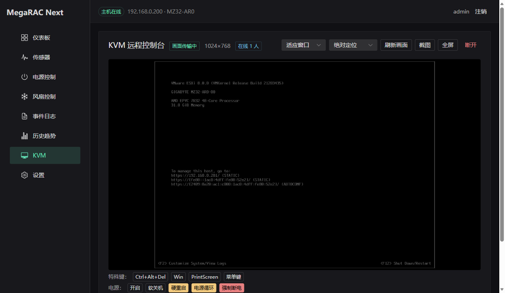
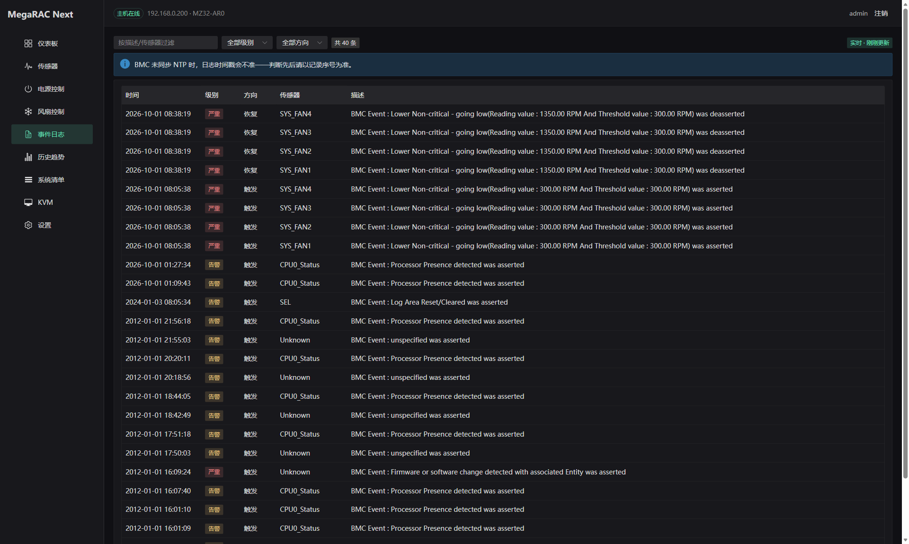

# MegaRAC-Next

把一块技嘉 **MZ32-AR0**（AMD EPYC 7R32）主板上的 **AMI MegaRAC SP-X** BMC 管理界面，
逆向后重制成了一个现代化的 Web UI —— 并附带一个**完全自研的 KVM 播放器**。

原厂界面是十多年前的风格（Bootstrap 3 + jQuery、满屏英文长表），这个重制版用
Fastify + Vue 3 + Naive UI + ECharts 重写：界面简体中文、暗色优先、移动端可用。

> 全部协议结论都来自对**自己这台机器的 BMC** 的实测。文档里标「实测」的都是真机验证过的结论，
> 标「推断」的会明说；逆向过程、踩坑与救场记录见 [`docs/API.md`](docs/API.md)。

## 固件安全升级（2026-09-30 已完成）

这台 BMC 原本跑着 **12.41.11（2020-03-20）**，带着 **CVE-2024-54085**（CVSS 10.0，已被 CISA 列入
KEV、有在野利用）以及 CVE-2023-34329/34330。现已升级到 **12.61.39（2025-07-02）**，三个漏洞随之关闭。

升级过程相当折腾，因为**出带（web/Redfish）升级在这块板子上是坏的**——
原厂向导按文件扩展名分派，把 `.bin` 当裸 BIOS 镜像处理，导致刷写组件识别不出来（浏览器控制台里
`component: undefined`），`hpm/flash` 必然 500；Redfish `SimpleUpdate` 则直接无限挂起。
技嘉官方指南也只写了带内（Linux/Windows/UEFI 跑 `gigaflash`）方式。

最终走通的是**让 BMC 自己从 TFTP 拉镜像**（`fwimage_location` + `dwldfwimg`），
完整流程、TFTP 服务的两个必须踩对的坑（69 端口回包、blksize 协商）、以及三条失败路径的
逐条定位都记在 [`docs/API.md`](docs/API.md) 第 10 节。复现只需一条命令：

```bash
# 在一台 BMC 可达的 Linux 主机上（本次用的是它自己的 ESXi）：跑 TFTP 服务
python3 reverse/tftp_server.py 69 /path/to/firmware   # 目录里放 rom.ima
# 在能访问 BMC 的机器上：配置位置 → 触发下载 → 校验 → 刷写 → 监控到版本变化
BMC_PASS=... node reverse/flash_via_tftp_full.mjs
```

配置**全部保留**（网络/用户/风扇档案/介质设置逐字段比对过），主机与虚拟机全程未受影响。
需要注意的是新固件按发布说明**移除了 SSH 服务**，以后只能走 Web / Redfish / IPMI。


## 界面

| 仪表盘 | 风扇曲线 |
|---|---|
|  |  |

| KVM 远程控制台 | 事件日志（SEL） |
|---|---|
|  |  |

## 功能

| 页面 | 说明 |
|---|---|
| **仪表盘** | 固件版本 / 开机时长 / 温度 / 风扇卡片 + 实时趋势图 |
| **传感器** | 全量传感器表（读数、状态、六档阈值），可排序 |
| **电源控制** | 开机 / 关机 / ACPI 软关机 / 硬重启 / 电源循环，均带二次确认 |
| **风扇控制** | 完整策略编辑器：Step / Slope 算法、源传感器与被控风扇多选、初始占空比、滞回、TDP / 环境温度 / PCIe 执行条件；**曲线编辑器**支持 6 种预设形状取样为有限数据点（等距或按斜率自适应取点）、增删数据点 |
| **事件日志** | SEL 全表 + 关键词 / 传感器 / 方向筛选 + 分页（20/50/100/200） |
| **历史趋势** | 代理侧定时采样落盘（`HistoryStore` 接口 + SQLite），可多传感器叠加 |
| **KVM** | 自研播放器：实时画面、键鼠、截图、全屏、缩放、Ctrl+Alt+Del / Win / PrintScreen 等特殊键、页内电源控制、在线客户端列表 |
| **设置** | FRU / 用户（可增删改）/ 网络 / 日期时间 / 服务；含「清理僵尸会话」自救按钮 |

## KVM 播放器（本项目最有意思的部分）

不复用原厂 `viewer.min.js`，只复用 BMC 自带的 AST2100 解码 worker，整条链路都是自己实现的：

```
BMC ──wss /kvm──► 代理（Node）──ws /api/kvm──► 浏览器
                    │  · IVTP 握手（含必须的 CONNECTION_COMPLETE 头）
                    │  · 按帧重组（帧头 86B + CompressSize）
                    │  · 主从协商（CMD_SET_NEXT_MASTER）
                    └  · 键鼠 USB-HID 报文编码（与原厂逐字节一致）
```

几个踩过的坑（都有实测记录）：

- **BMC 的 WebSocket 是字节流**：包会跨消息、消息也可含多包，必须跨消息累积重组；
- **视频帧是差分的**（skip 码沿用上一帧像素），所以浏览器刷新/重连时不能自己解析裸流——
  现在由**服务端重组整帧**后下发，浏览器天然从下一个完整帧开始渲染；
- **主从权限**：`VALIDATED` 的 `payload[1]` 是会话序号，`>0` 表示自己是从属——
  **画面照常但键鼠全无效**，特别有迷惑性；从属要发 `CMD_SET_NEXT_MASTER` 申请，
  自身为主控时则自动同意他人的申请；
- **解码 worker 的输出缓冲必须跨帧持续存在**，每帧新建空白缓冲会把未变化区域抹成黑块；
- 重连要**复用未断的 BMC 会话**并索取整屏完整帧，否则 BMC 还没释放主控、新连接会变成从属。

完整协议见 [`docs/API.md` 第 7 节](docs/API.md)。

## 快速开始

```bash
npm install

npm run dev:server   # 代理，默认 http://0.0.0.0:5177
npm run dev:web      # 前端，默认 http://0.0.0.0:5173
```

浏览器打开 `http://localhost:5173`，用 **BMC 的账号密码**登录（凭证只经代理内存转发，不落盘）。

可用环境变量：

| 变量 | 默认 | 说明 |
|---|---|---|
| `BMC_BASE` | `https://192.168.0.200` | BMC 地址 |
| `HOST` / `PORT` | `0.0.0.0` / `5177` | 代理监听 |
| `BMC_TIMEOUT_MS` | `30000` | 单请求超时（该 BMC 慢时单请求可达 20 秒） |
| `HISTORY_DB` | `data/history.sqlite3` | 历史趋势库 |
| `BMC_MAX_QUEUED` | `8` | 串行队列上限（防雪崩） |
| `BMC_LOGIN_COOLDOWN_MS` | `15000` | 两次登录最小间隔（防重登风暴） |

## 目录结构

```
docs/API.md        逆向文档：240 个端点、会话协议、风扇写协议、KVM / SOL / 虚拟介质协议
docs/images/       README 配图
server/            Fastify 代理
  bmc.ts             BMC 客户端（单会话池化 + 登录冷却/熔断 + 串行队列）
  kvm.ts             KVM 中继：握手、整帧重组、主从协商
  kvm-route.ts       /api/kvm（WS 中继）与 /api/kvm/decoder.js（解码 worker 代理）
  hid.ts             键鼠 USB-HID 报文构造
  history/           采样器 + HistoryStore（SQLite 实现）
web/               Vue 3 + Vite 前端
  src/pages/         各页面
  src/kvm/           KVM 客户端与键码表
reverse/           逆向工作区（探针脚本 + 样本；AMI 版权产物已 gitignore）
```

## 已知限制

- **虚拟介质（挂 ISO）做不了**：协议已完整逆向（`/cd-server` + iusb/SCSI，见 `docs/API.md` 第 8 节），
  但 SP-X 的 vMedia 属 **LMEDIA/RMEDIA 授权模块**（AMI 采用按包授权），
  本机开关 PUT 返回 200 却不生效，需要向 AMI / 技嘉取得 license key。
- **设置页写操作部分验证**：用户增删改**已实测通过**；服务配置写入被 BMC 拒绝
  （500 code 1198/1199，疑似需要扩展权限）；日期时间与网络（高危）未实测，界面上已如实标注。
- **鼠标指针效果未在客机验证**：报文已与原厂逐字节核对一致并确认送达，
  但当前主机停在 ESXi DCUI（本身不支持鼠标），需要一个带图形界面的客机来复核。
- **BMC 会话表只有 148 格**，且同账号再登录会踢掉先前会话。代理已做单会话池化、
  登录冷却与熔断以防打满；万一卡死，`docs/API.md` 第 7 节给了四级救场流程（含 IPMI 冷重置脚本）。

## 免责声明

本项目用于管理**自己拥有**的服务器硬件，逆向对象是自己这台机器上的固件前端。
仓库内不含 AMI 的版权代码与二进制（`source.min.js` / `viewer.min.js` / `libs/kvm/*` 等已在
`.gitignore` 中排除），KVM 解码 worker 由代理在运行时从 BMC 自身取回。
